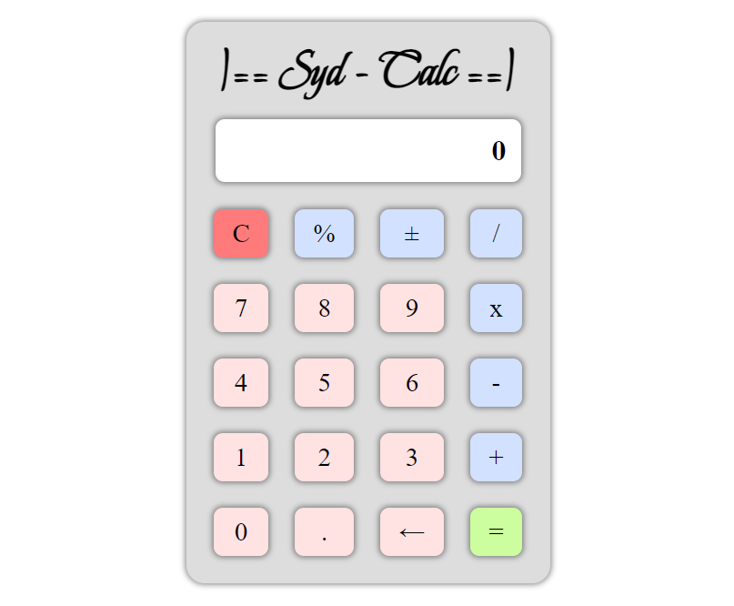

# JavaScript Calculator with Cypress Testing
## About
As a Nology consultant, I was advised that I should have something with testing in my software Portfolio. \
So I developed a simple (not so simple) old-skool Calculator App to demonstrate that I also cater for unit and end to end App testing. \
A fully working Calculator that also incorprates CYPRESS testing to validate its calculations. \
Built on JavaScript & SCSS, with the CYPRESS testing framework. \
Hosted at: https://sydneymurray.github.io/nology-javascript-calculator-cypress-testing/

  

## How to build this app
mkdir nology-javascript-calculator-cypress-testing \
cd nology-javascript-calculator-cypress-testing \
git clone https://github.com/sydneymurray/nology-javascript-calculator-cypress-testing.git \
npm install

## Run a Cypress Test Suite
npx cypress open
